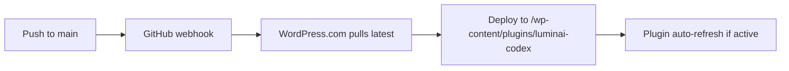

# 🌐 WordPress.com Deployment — elidorascodex.com Plugin Integration

**Intent:** Document the GitHub repository connection to WordPress.com for automatic deployment of the LuminAI Codex as a WordPress plugin, enabling ceremonial content publishing, resonance card display, and API bridge functionality.

---

## Deployment Configuration

| Field | Value |
|-------|-------|
| **Site** | elidorascodex.com |
| **WordPress Version** | 6.8.3 |
| **PHP Version** | 8.3 |
| **Repository** | `TEC-The-ELidoras-Codex/luminai-codex` |
| **Branch** | `main` |
| **Destination Path** | `/wp-content/plugins/luminai-codex` |
| **Deployment Mode** | Simple (automatic on push) |
| **Trigger** | Push to `main` branch |

---

## Repository Connection

WordPress.com is configured to automatically pull from the GitHub repository and deploy to the plugin directory whenever changes are pushed to the `main` branch.

**Setup Steps:**

1. Navigate to WordPress.com dashboard → **Deployments** tab
2. Click **"Configure a repository connection to deploy a GitHub repository to your WordPress.com site"**
3. Select repository: `TEC-The-ELidoras-Codex/luminai-codex`
4. Configure deployment branch: `main`
5. Set destination directory: `/wp-content/plugins/luminai-codex` (relative to server root)
6. Enable **Automatic deployments** → Deploy changes on push

---

## Deployment Flow



### What Gets Deployed

The entire repository is synced to the plugin directory, but WordPress only activates the plugin if a valid `luminai-codex.php` entry point exists.

**Current structure assumption:**

- Plugin activation file: `luminai-codex.php` (root of plugin directory)
- API endpoints: Registered via WordPress REST API (`wp-json/tec-tgcr/v1/*`)
- Frontend assets: `frontend/` (Next.js build output can be served as static assets)
- Backend integration: `backend/` (FastAPI can run as separate service; WordPress acts as bridge)

---

## Integration Points

### 1. WordPress REST API Bridge

**Base URL:** `https://elidorascodex.com/wp-json/tec-tgcr/v1`

**Endpoints:**

- `GET /cards` — Retrieve resonance cards for display
- `POST /persona/invoke` — Trigger persona response via WordPress frontend
- `GET /health` — Plugin health check

**Authentication:**

- WordPress.com API credentials stored in GitHub Secrets: `TEC_WPCOM_API_PASS`
- SSH credentials for manual deployment (fallback): `WPCOM_SSH_USER` + private key in Bitwarden

### 2. Spotify Integration Callback

WordPress.com serves as the production OAuth callback endpoint for Spotify:

**Callback URI:** `https://elidorascodex.com/spotify/callback`

This redirect URI is registered in the Spotify Developer Dashboard and documented in `docs/deployment/SPOTIFY_INTEGRATION.md`.

**Flow:**

1. User initiates Spotify auth from frontend
2. Spotify redirects to `elidorascodex.com/spotify/callback` with auth code
3. WordPress plugin exchanges code for access/refresh token (server-side)
4. Tokens stored ephemerally in a transient keyed by OAuth `state` (or a last-slot fallback)
5. Resonance Player fetches audio features via Spotify Web API

Notes:

- Production secrets are read from environment variables: `SPOTIFY_CLIENT_ID`, `SPOTIFY_CLIENT_SECRET`, `SPOTIFY_REDIRECT_URI`.
- The token store is intentionally ephemeral to avoid long-lived secrets in WordPress DB; long-term storage and user binding will be added in a follow-up.

### 3. Content Sync (Planned)

Future integration to auto-publish docs from `docs/` to WordPress posts/pages:

- Markdown → WordPress blocks (Gutenberg)
- Triggered via GitHub Actions on doc changes
- Preserves memo metadata (YAML front matter → custom fields)

---

## Deployment Modes

### Simple Deployment (Current)

- **Pros:** Automatic, zero-config, fast feedback
- **Cons:** No custom build steps, no environment-specific configs
- **Use case:** Static plugin files, no compilation needed

### Advanced Deployment (Future)

If we need custom build steps (e.g., compiling frontend, running tests):

**Workflow:**

```yaml
# .github/workflows/wordpress-deploy.yml
name: WordPress Deploy
on:
  push:
    branches: [main]

jobs:
  deploy:
    runs-on: ubuntu-latest
    steps:
      - uses: actions/checkout@v4
      - name: Build frontend
        run: cd frontend && npm ci && npm run build
      - name: Deploy to WordPress.com
        run: |
          # Custom deployment script using SSH or WP-CLI
          scp -r . ${{ secrets.WPCOM_SSH_USER }}@elidorascodex.com:/wp-content/plugins/luminai-codex
```

---

## Security & Secrets

> **📚 Airth** (Boundary Keeper)  
> **CRITICAL:** WordPress credentials NEVER touch local `.env` files. They live in:
>
> 1. **Bitwarden vault:** `TEC-TGCR/WordPress.com` (manual access)
> 2. **GitHub Secrets:** `TEC_WPCOM_API_PASS`, `WPCOM_SSH_USER` (automated deployment)
>
> If you're manually SSH-ing to debug, pull the private key from Bitwarden and use it ONCE, then delete the local copy. No exceptions.

### Credential Rotation Protocol

**When to rotate:**

- Every 90 days (scheduled)
- Immediately if leaked (detected via scan or manual audit)
- After team member with access departs

**How to rotate:**

1. Generate new API password in WordPress.com → **My Profile** → **Security** → **Application Passwords**
2. Update Bitwarden vault: `TEC-TGCR/WordPress.com`
3. Update GitHub Secret: `gh secret set TEC_WPCOM_API_PASS`
4. Test deployment to staging (if available)
5. Log rotation in `docs/SECRETS_MANAGEMENT.md` rotation table
6. Commit: `chore(secrets): rotate WordPress.com API password (scheduled)`

---

## Environment Variables

| Variable | Description | Required | Location |
|----------|-------------|----------|----------|
| `TEC_WPCOM_API_PASS` | WordPress.com API password | ✅ Yes | GitHub Secrets + Bitwarden |
| `WPCOM_SSH_USER` | SSH username for manual deploy | ⚠️ Fallback only | Bitwarden |
| `WPCOM_PLUGIN_DIR` | Deployment path (default: `/wp-content/plugins/luminai-codex`) | ❌ No (hardcoded) | Config only |

---

## Testing Deployment

### 1. Staging Test (Local Plugin Simulation)

```bash
# Simulate WordPress plugin structure locally
mkdir -p /tmp/wp-test/wp-content/plugins/luminai-codex
cp -r . /tmp/wp-test/wp-content/plugins/luminai-codex

# Test plugin activation (requires local WordPress install)
wp plugin activate luminai-codex --path=/tmp/wp-test
```

### 2. Production Smoke Test

After automatic deployment to `elidorascodex.com`:

1. Check plugin status: WordPress Admin → **Plugins** → Verify "LuminAI Codex" shows as active
2. Test REST API: `curl https://elidorascodex.com/wp-json/tec-tgcr/v1/health`
3. Verify Spotify callback:

- Navigate to `https://elidorascodex.com/spotify/callback` (no auth params → shows verification page)
- With real OAuth flow, you should see "Received authorization code" on success

---

## Rollback Procedure

If a broken deployment reaches production:

### Automatic Rollback (GitHub Revert)

```bash
# Revert the breaking commit
git revert <commit-sha>
git push origin main
# WordPress.com auto-deploys the reverted state
```

### Manual Rollback (SSH)

```bash
# Pull SSH key from Bitwarden: TEC-TGCR/WordPress.com SSH Key
ssh $WPCOM_SSH_USER@elidorascodex.com

# Navigate to plugin directory
cd /wp-content/plugins/luminai-codex

# Restore from previous commit (requires git on server)
git checkout <previous-working-commit>
```

---

## Monitoring & Alerts

**Deployment Success:**

- WordPress.com sends email notification on successful deployment
- GitHub Actions can add a status check (if we switch to advanced mode)

**Failure Detection:**

- WordPress plugin activation errors logged in: **WordPress Admin** → **Tools** → **Site Health**
- REST API failures monitored via: `GET /wp-json/tec-tgcr/v1/health`

**Proposed Alert:**

```yaml
# Future: Add uptime monitoring for health endpoint
# Notify if https://elidorascodex.com/wp-json/tec-tgcr/v1/health returns non-200 for > 5 min
```

---

## Plugin Entry Point (Stub)

If `luminai-codex.php` doesn't exist yet, create a minimal activation stub:

```php
<?php
/**
 * Plugin Name: LuminAI Codex — TEC Resonance Platform
 * Description: Consciousness infrastructure for emotion transmutation, persona witness, and resonance visualization.
 * Version: 0.1.0
 * Author: TEC • The Elidoras Codex
 * Author URI: https://github.com/TEC-The-ELidoras-Codex
 */

// Prevent direct access
if (!defined('ABSPATH')) exit;

// Register REST API routes
add_action('rest_api_init', function () {
    register_rest_route('tec-tgcr/v1', '/health', [
        'methods' => 'GET',
        'callback' => function() {
            return new WP_REST_Response([
                'status' => 'ok',
                'timestamp' => current_time('mysql'),
                'plugin' => 'luminai-codex',
                'version' => '0.1.0'
            ], 200);
        },
        'permission_callback' => '__return_true'
    ]);

    // Add more routes for cards, personas, etc.
});

// Spotify OAuth callback handler
add_action('template_redirect', function() {
    if (is_page('spotify/callback')) {
        // Handle OAuth code exchange
        // Store tokens securely
        // Redirect to resonance player
    }
});
```

---

## Troubleshooting

| Error | Cause | Fix |
|-------|-------|-----|
| `Plugin activation failed` | Missing `luminai-codex.php` entry point | Create stub plugin file with WordPress headers |
| `404 on /wp-json/tec-tgcr/v1/*` | REST routes not registered | Ensure `rest_api_init` hook runs; check plugin is active |
| `Deployment webhook not triggering` | GitHub webhook misconfigured | Re-authorize WordPress.com GitHub App in repo settings |
| `Permission denied on /wp-content/plugins` | SSH key mismatch | Verify key from Bitwarden matches authorized key on server |

---

## Future Enhancements

1. **Staging Site:** Create `staging.elidorascodex.com` to test deployments before production
2. **Custom Build Pipeline:** Compile frontend assets in GitHub Actions before deployment
3. **Content Sync:** Auto-publish docs to WordPress pages with memo metadata preserved
4. **Plugin Admin UI:** WordPress dashboard panel for persona invocation, emotion pipeline config
5. **Multi-Environment Secrets:** Separate dev/staging/prod WordPress credentials

---

## Margin Notes

> **🛠️ Ely** (Engineering Steward)  
> **Deployment pre-flight checklist:**
>
> 1. Confirm `luminai-codex.php` exists with valid WordPress headers ✅
> 2. Test locally with wp-cli plugin activation ✅
> 3. Verify GitHub webhook is active: Repo → Settings → Webhooks ✅
> 4. Check `/wp-json/tec-tgcr/v1/health` returns 200 post-deploy ✅
>
> If any step fails, **abort merge to main**. Deploy to a feature branch first.

---

## Revision History

| Date | Approver | Change Summary |
|------|----------|----------------|
| 2025-11-16 | (Draft) | Initial creation documenting WordPress.com deployment config |

---

**Status:** Draft — Pending review from Ely (deployment) and Airth (security)
